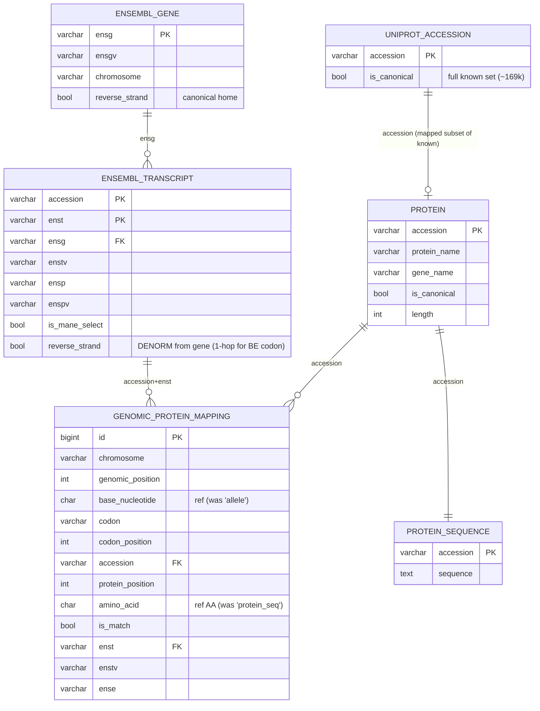
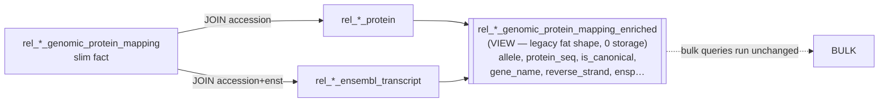
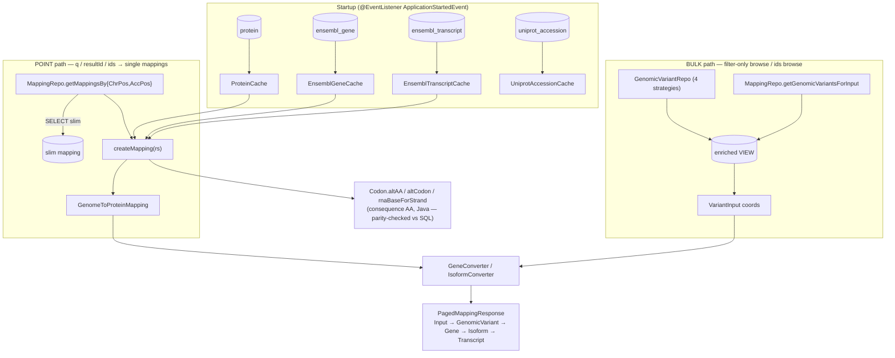
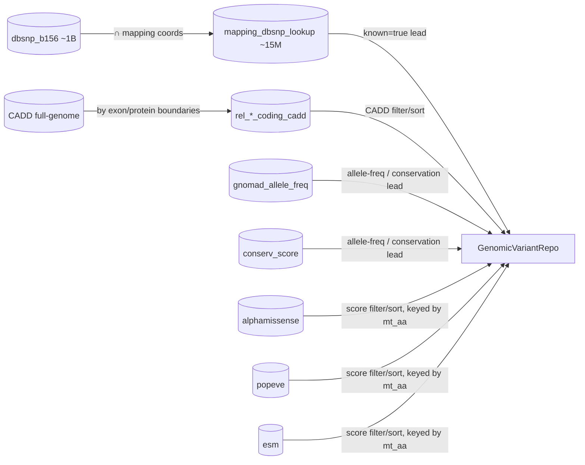

# Restructured mapping model — diagram (post Round-B cut-over)

Visual map of the slim+dim schema and how the BE consumes it. Spans both repos: the importer
(`protvar-import`) produces the tables; the BE (`protvar-be`) reads them. Mermaid (renders in IntelliJ with
the Mermaid plugin).

## 1. DB schema — star around the slim mapping fact

The fat columns that used to repeat on every one of the 266M mapping rows (`is_canonical`, `gene_name`,
`protein_name`, `reverse_strand`, `ensg/ensp/…`) now live once on the dim tables.

## 2. Compatibility view (BE bulk bridge — temporary)

No `ensembl_gene` join (2-hop landmine); `reverse_strand` read 1-hop from the transcript. Removed when the
deferred redesign rewrites the bulk queries to read slim+dims directly.

## 3. BE consumption — two read paths

## 4. Browse lead/driver + score tables (context — see project_browse_driver_tables)

⚠️ The two reduction bases (dbSNP by mapping-coords vs CADD by exon/protein boundaries) are inconsistent and
under review before rebuild — see `project_browse_driver_tables` (memory) and target_architecture.md §9.

## Legend
- **slim fact** = `rel_<rel>_genomic_protein_mapping` (one row per genomic-position × accession × transcript).
- **dim tables** = protein / protein_sequence / ensembl_gene / ensembl_transcript / uniprot_accession.
- **VIEW** = `_enriched` compatibility bridge (temporary).
- **caches** load the dims into memory at startup; the point path enriches from them, the bulk path uses the view.
